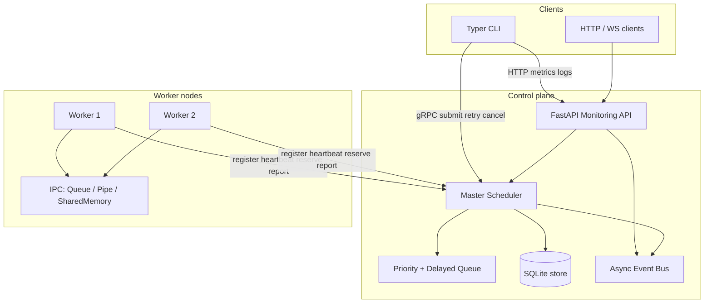
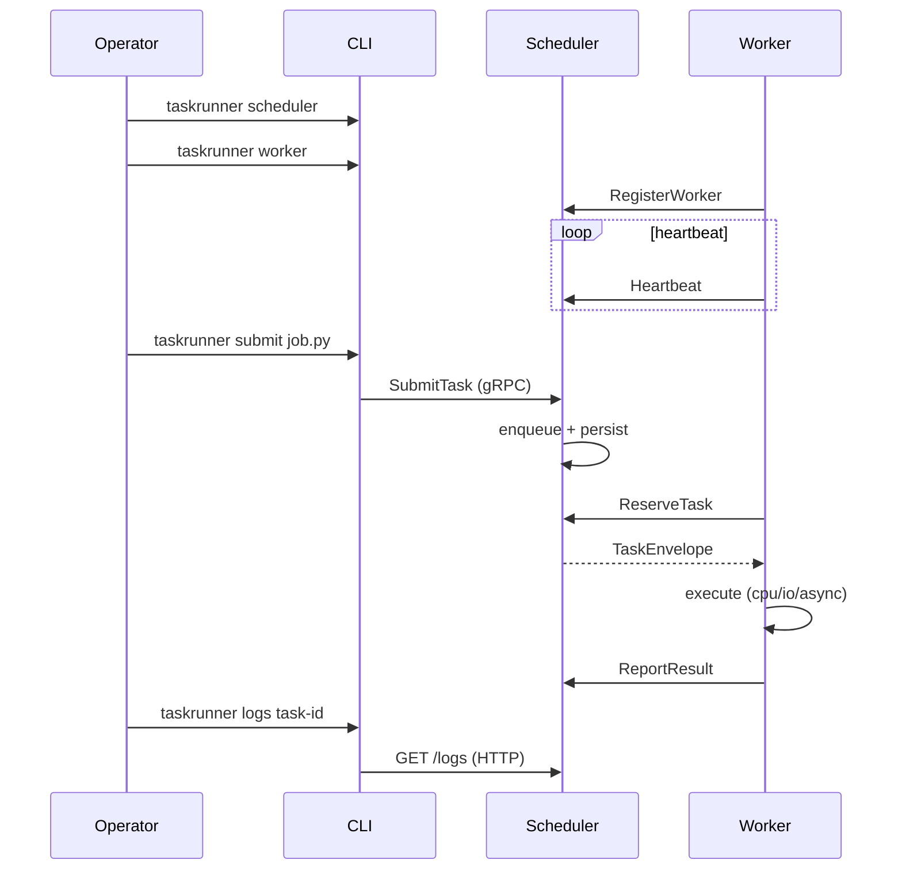
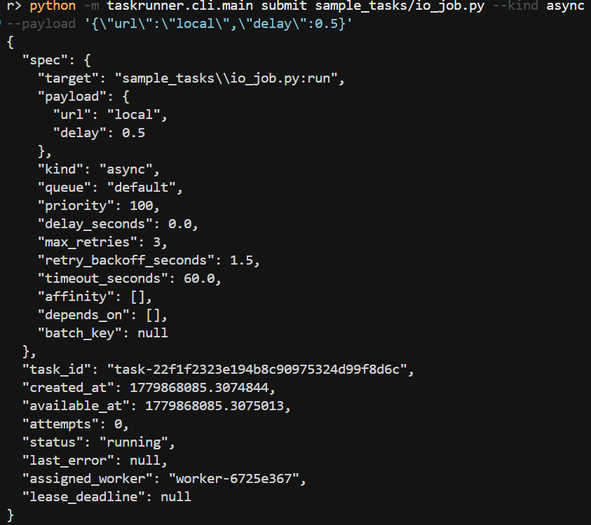
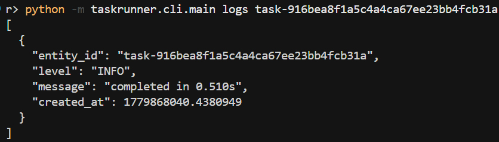
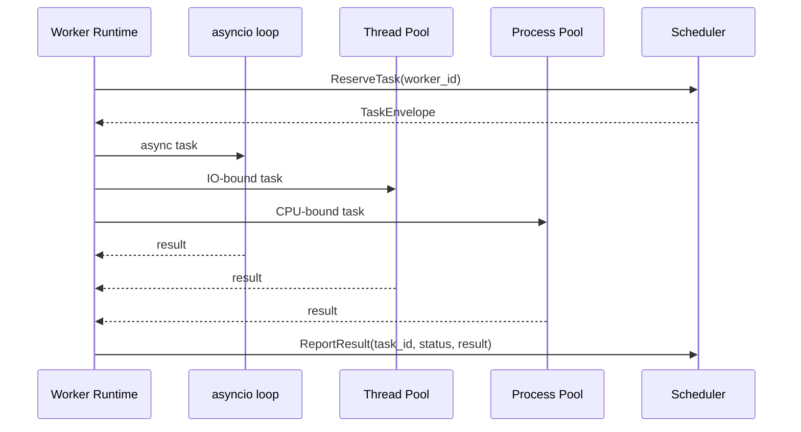
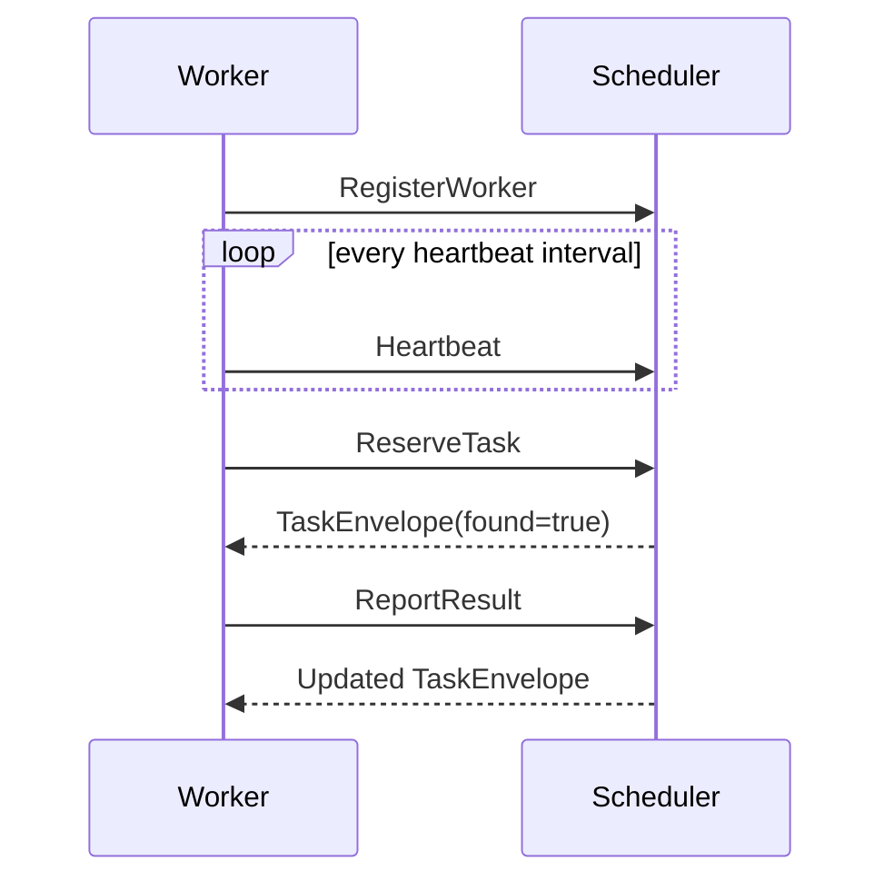

# Distributed Task Runner CLI

A production-style **distributed task execution framework** in Python 3.12+. It demonstrates how to build a real control plane: a central scheduler, worker nodes, priority queues with retries, gRPC coordination, FastAPI monitoring, SQLite persistence, and a Typer CLI for day-to-day operations.

There is **no separate web dashboard** — you operate the system through the **CLI** and the **HTTP/WebSocket API** (Swagger UI at `/docs`).

---

## Table of contents

- [About the project](#about-the-project)
- [Features](#features)
- [Architecture](#architecture)
- [End-to-end workflow](#end-to-end-workflow)
- [How task routing works](#how-task-routing-works)
- [Repository layout](#repository-layout)
- [Prerequisites](#prerequisites)
- [Installation](#installation)
- [How to run](#how-to-run)
- [CLI demo (with screenshots)](#cli-demo-with-screenshots)
- [Submitting tasks to workers](#submitting-tasks-to-workers)
- [Verify it is working](#verify-it-is-working)
- [Monitoring API](#monitoring-api)
- [Configuration](#configuration)
- [Concurrency model](#concurrency-model)
- [IPC model](#ipc-model)
- [gRPC flow](#grpc-flow)
- [Docker](#docker)
- [Linux operations](#linux-operations)
- [Development](#development)

---

## About the project

This project is a **learning and portfolio-grade** implementation of patterns you see in systems like Celery, Sidekiq, or cloud batch runners — but small enough to read in an afternoon.

| Role | Responsibility |
|------|----------------|
| **Scheduler** | Owns the queue, assigns work, tracks leases, persists state, exposes gRPC + HTTP |
| **Worker** | Registers with the scheduler, heartbeats, reserves tasks, executes them, reports results |
| **CLI** | Submits/cancels/retries tasks, lists workers/queues, streams metrics |
| **API** | JSON endpoints + WebSocket event stream for observability |

Workers are **not** chosen manually when you submit. You send a task to the **scheduler**; it picks an idle worker that matches the **queue**, **task kind**, and optional **affinity labels**.

---

## Features

### Distributed execution

- Scheduler + worker roles with gRPC registration, heartbeats, and result reporting
- Worker capacity limits (concurrent task slots per node)
- Queue affinity: workers subscribe to named queues (`default`, `cpu`, `io`, …)
- Label affinity: route CPU/GPU-oriented work to labeled workers

### Queue semantics

- Priority ordering (lower number runs first)
- Delayed tasks (`--delay`)
- Retries with backoff, cancellation, acknowledgements
- Dead-letter queue, dependency gates, batch lookup
- Backpressure metrics and autoscaling recommendations

### Execution engine

| `kind` | Runtime | Use for |
|--------|---------|---------|
| `cpu` | `ProcessPoolExecutor` | CPU-bound work (hashing, image processing) |
| `io` | `ThreadPoolExecutor` | Blocking I/O (files, network) |
| `async` | asyncio event loop | Coroutine tasks (`async def run`) |
| `scheduled` | scheduler-driven | Delayed / scheduled execution |

### Observability

- FastAPI monitoring API: health, metrics, workers, queues, tasks, logs
- WebSocket live events at `WS /events`
- CLI `monitor` command for terminal dashboards
- Structured JSON logging

### Operations

- Graceful shutdown, signal handling
- Docker Compose multi-service deployment
- Makefile, GitHub Actions CI, pytest suite
- Linux daemon helper scripts

---

## Architecture



The scheduler is the **single source of truth** for task state. Workers are stateless executors that pull work through `ReserveTask` RPCs.

---

## End-to-end workflow



### Typical session

1. **Install** the package and generate protobuf stubs.
2. **Start the scheduler** (gRPC + FastAPI in one process).
3. **Start one or more workers** (each connects to the scheduler).
4. **Submit tasks** via CLI or `POST /tasks`.
5. **Observe** with `workers`, `queues`, `monitor`, `/health`, or `/docs`.
6. **Retry or cancel** failed or stuck tasks as needed.

---

## How task routing works

When you run `taskrunner submit`, the scheduler:

1. Validates the task spec (target path, kind, queue, payload JSON).
2. Enqueues by **priority** and **available_at** (delay).
3. Waits for a worker to call **ReserveTask**.
4. Picks a worker that is **idle**, subscribed to the **queue**, and matches **affinity labels** (if any).
5. Assigns a **lease**; if the worker dies, the lease expires and the task is requeued.

Example: submit an async I/O job to the `default` queue — any worker listening on `default` with free capacity may receive it.

```bash
taskrunner submit sample_tasks/io_job.py --kind async --payload '{"url":"local","delay":0.5}'
```

Response includes `"assigned_worker": "worker-abc123"` — that is the node executing your job.

---

## Repository layout

```text
taskrunner/
  api/          FastAPI monitoring and control plane
  cli/          Typer CLI entrypoints
  database/     SQLite persistence layer
  grpc/         protobuf schema, generated stubs, client/server
  monitoring/   metrics aggregation
  queue/        priority / delay / retry / DLQ broker
  scheduler/    master scheduler engine and service runner
  shared/       models, config, logging, event bus, locks
  workers/      worker runtime, executor, IPC
tests/          concurrency, async, IPC, API, scheduler tests
sample_tasks/   CPU, async IO, and failing sample jobs
scripts/        Linux process management helpers
deploy/         SSH-ready config example
docs/images/    CLI screenshot assets for this README
```

---

## Prerequisites

- **Python 3.12+**
- **pip** (and optionally **make** on Linux/macOS)
- **Docker** (optional, for Compose deployment)

On Windows, use `python -m taskrunner.cli.main` if the `taskrunner` script is not on your `PATH`.

---

## Installation

```bash
python -m pip install -e ".[dev]"
```

Generate gRPC/protobuf stubs after cloning or changing `taskrunner.proto`:

```bash
# Linux/macOS
make proto

# Windows (equivalent)
python -m grpc_tools.protoc -I . --python_out=. --grpc_python_out=. taskrunner/grpc/protos/taskrunner.proto
```

---

## How to run

### Option A — Local (two terminals)

**Terminal 1 — scheduler** (gRPC + API):

```bash
taskrunner scheduler
```

**Terminal 2 — worker:**

```bash
taskrunner worker --queues default,cpu,io --labels cpu,gpu --capacity 2
```

Default endpoints:

| Service | URL |
|---------|-----|
| Monitoring API | http://127.0.0.1:8080 |
| gRPC scheduler | `127.0.0.1:50051` |
| Swagger UI | http://127.0.0.1:8080/docs |

### Option B — Windows (PowerShell)

If `taskrunner` is not on `PATH`:

```powershell
python -m pip install -e ".[dev]"
python -m taskrunner.cli.main scheduler
```

Second terminal:

```powershell
python -m taskrunner.cli.main worker --queues default,cpu,io --labels cpu,gpu --capacity 2
```

**Port conflicts:** If `8080` or `50051` are already in use, pick alternate ports:

```powershell
$env:TASKRUNNER_API_PORT = "18080"
$env:TASKRUNNER_SCHEDULER_GRPC_PORT = "50052"
python -m taskrunner.cli.main scheduler
```

Set the **same** `TASKRUNNER_SCHEDULER_GRPC_PORT` in the worker terminal and for every CLI command.

**JSON payloads in PowerShell** — escape quotes:

```powershell
python -m taskrunner.cli.main submit sample_tasks/io_job.py --kind async --payload '{\"url\":\"local\",\"delay\":0.5}'
```

### Option C — Docker Compose

```bash
docker compose up --build
```

Scale workers:

```bash
docker compose up --scale worker=4
```

---

## CLI demo (with screenshots)

### img-01 — Submit a task

Submit an async sample job; the scheduler returns a `task_id` and the **assigned worker**.



**Command:**

```powershell
$env:TASKRUNNER_SCHEDULER_GRPC_PORT = "50052"   # only if using custom ports
python -m taskrunner.cli.main submit sample_tasks/io_job.py --kind async --payload '{\"url\":\"local\",\"delay\":0.5}'
```


Confirm completion:

```bash
taskrunner logs task-22f1f2323e194b8c90975324d99f8d6c
```

```json
[
  {
    "entity_id": "task-22f1f2323e194b8c90975324d99f8d6c",
    "level": "INFO",
    "message": "completed in 0.510s"
  }
]
```

### img-02 — Metrics 




**Command:**

```bash
taskrunner monitor
# or: taskrunner monitor --interval 1
```


---

## Submitting tasks to workers

You submit to the **scheduler**, not to a worker ID directly.

| Command | Purpose |
|---------|---------|
| `taskrunner scheduler` | Run control plane |
| `taskrunner worker` | Run executor node |
| `taskrunner submit <file>` | Enqueue a job |
| `taskrunner workers` | List registered workers |
| `taskrunner queues` | Queue depth / DLQ metrics |
| `taskrunner monitor` | Live metrics loop |
| `taskrunner logs <task_id>` | Task or worker logs |
| `taskrunner retry <task_id>` | Re-queue failed task |
| `taskrunner cancel <task_id>` | Cancel queued/running task |

### Sample tasks

| File | Kind | Description |
|------|------|-------------|
| `sample_tasks/io_job.py` | `async` | Simulated async I/O (`async def run`) |
| `sample_tasks/image_job.py` | `cpu` | SHA-256 loop (CPU-bound) |
| `sample_tasks/failing_job.py` | any | Intentional failure for retry/DLQ testing |

**CPU task:**

```bash
taskrunner submit sample_tasks/image_job.py --kind cpu --queue cpu \
  --payload '{"path":"README.md","rounds":5000}'
```

**With worker label affinity:**

```bash
taskrunner submit sample_tasks/image_job.py --kind cpu --affinity cpu \
  --payload '{"path":"README.md","rounds":1000}'
```

**Custom task file** (`my_job.py`):

```python
async def run(name: str = "world") -> dict:
    return {"greeting": f"hello {name}"}
```

```bash
taskrunner submit my_job.py --kind async --payload '{"name":"taskrunner"}'
```

---

## Verify it is working

| Step | Command / URL | Pass criteria |
|------|---------------|---------------|
| 1 | http://127.0.0.1:8080/health | `"status": "ok"` |
| 2 | `taskrunner workers` | ≥1 worker, recent `last_heartbeat` |
| 3 | `taskrunner submit sample_tasks/io_job.py --kind async -p '{"url":"x","delay":0.2}'` | `assigned_worker` present |
| 4 | `taskrunner logs <task_id>` | `"completed in …"` message |
| 5 | `taskrunner monitor` | `tasks.succeeded` increases |
| 6 | `pytest -q` | All tests green (no services required) |

**Troubleshooting**

| Symptom | Fix |
|---------|-----|
| Cannot bind port 8080 / 50051 | Use `TASKRUNNER_API_PORT` / `TASKRUNNER_SCHEDULER_GRPC_PORT` |
| `Method not found!` on worker | Worker and scheduler must use the **same** gRPC port |
| Task stays `queued` | Start a worker subscribed to that queue |
| `taskrunner` not found | Use `python -m taskrunner.cli.main` |

---

## Monitoring API

Interactive docs: **http://127.0.0.1:8080/docs**

| Method | Path | Description |
|--------|------|-------------|
| `POST` | `/tasks` | Submit a task |
| `POST` | `/tasks/batch` | Submit multiple tasks |
| `GET` | `/tasks` | Recent task history |
| `POST` | `/tasks/{task_id}/cancel` | Cancel |
| `POST` | `/tasks/{task_id}/retry` | Retry |
| `GET` | `/workers` | Worker registry |
| `GET` | `/queues` | Queue snapshot |
| `GET` | `/logs/{entity_id}` | Logs for task or worker |
| `GET` | `/metrics` | Aggregated metrics |
| `GET` | `/health` | Health + embedded metrics |
| `WS` | `/events` | Live event stream |

---

## Configuration

Environment variables (all optional):

```text
TASKRUNNER_SCHEDULER_HOST=127.0.0.1
TASKRUNNER_SCHEDULER_GRPC_PORT=50051
TASKRUNNER_API_HOST=127.0.0.1
TASKRUNNER_API_PORT=8080
TASKRUNNER_SQLITE_PATH=data/taskrunner.db
TASKRUNNER_WORKER_CAPACITY=2
TASKRUNNER_HEARTBEAT_INTERVAL_SECONDS=2
TASKRUNNER_HEARTBEAT_TIMEOUT_SECONDS=10
TASKRUNNER_LEASE_SECONDS=30
TASKRUNNER_MAX_QUEUE_DEPTH=10000
TASKRUNNER_LOG_LEVEL=INFO
```

---

## Concurrency model



Worker concurrency is bounded by `--capacity`. The scheduler requeues expired leases and marks stale workers offline when heartbeats stop.

---

## IPC model

Inside each worker node (local only; cross-node uses gRPC):

- `multiprocessing.Queue` — task/result envelopes
- `multiprocessing.Pipe` — control messages
- `shared_memory.SharedMemory` — hot counters (running/completed/failed)
- Sockets — health checks and sidecar integration

---

## gRPC flow



Regenerate stubs after editing `taskrunner/grpc/protos/taskrunner.proto`:

```bash
make proto
```

---

## Docker

```bash
docker compose up --build
```

Published ports:

- FastAPI: `http://localhost:8080`
- gRPC: `localhost:50051`

---

## Linux operations

Foreground:

```bash
scripts/run_scheduler.sh
scripts/run_worker.sh
```

Simple daemons:

```bash
scripts/daemonize.sh scheduler
scripts/daemonize.sh worker worker-1
```

See `deploy/ssh_config.example` for multi-host SSH layouts.

---

## Development

```bash
make install    # pip install -e ".[dev]"
make proto      # regenerate gRPC stubs
make lint       # ruff check
make test       # pytest -q
```

CI (`.github/workflows/ci.yml`) runs protobuf generation, linting, tests, and a Docker build.

The test suite covers queue ordering/retries, worker IPC, async execution, scheduler failure handling, and API metrics.

---

## License

See repository defaults. Contributions welcome via pull request.
