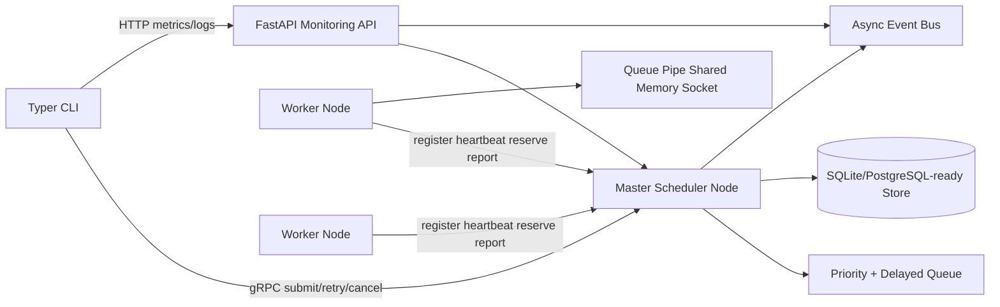
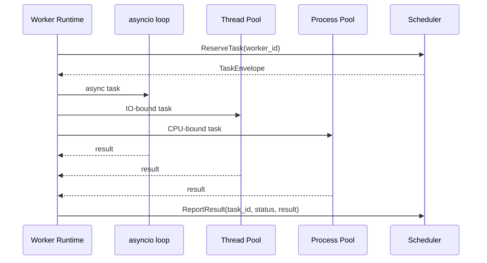
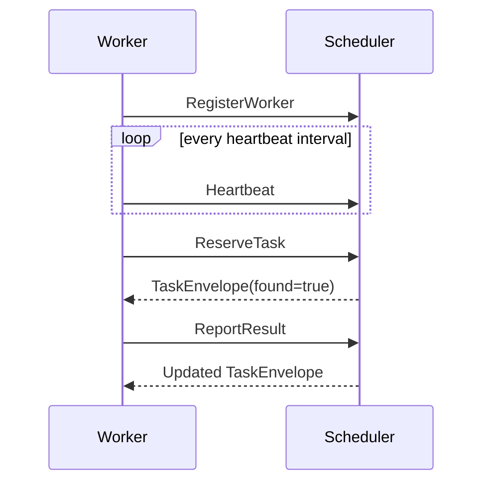

# Distributed Task Runner CLI

A production-style distributed task execution framework written in Python 3.12+. It demonstrates scheduler design, worker orchestration, asyncio services, multiprocessing/threading execution, IPC, gRPC/Protocol Buffers, FastAPI monitoring, SQLite persistence, Docker deployment, and CI.

## Architecture



The scheduler is the control plane. Workers register over gRPC, heartbeat periodically, reserve tasks with leases, execute them through CPU/process, IO/thread, or async paths, and report results. The FastAPI service exposes health, metrics, queue state, task history, logs, and WebSocket events.

## Core Capabilities

- Distributed roles: scheduler, workers, queue broker, monitoring API, CLI controller.
- Queue semantics: priority, delay, retry backoff, cancellation, acknowledgements, dead-letter queue, dependency gates, worker affinity, batch lookup, and backpressure metrics.
- Execution engine: `ProcessPoolExecutor` for CPU-bound tasks, `ThreadPoolExecutor` for blocking IO, and native asyncio for coroutine tasks.
- IPC: `multiprocessing.Queue`, duplex pipes, shared memory counters, and socket health checks inside worker nodes.
- gRPC: worker registration, heartbeats, task reservation/dispatch, result reporting, cancellation, and retry APIs defined in `taskrunner/grpc/protos/taskrunner.proto`.
- Monitoring: async FastAPI endpoints, WebSocket event stream, process metrics, queue pressure, autoscaling recommendation, and centralized logs.
- Operations: signal handling, graceful shutdown, daemon shell script, Docker, Compose, Makefile, GitHub Actions, linting, and pytest coverage.

## Repository Layout

```text
taskrunner/
  api/          FastAPI monitoring and control plane
  cli/          Typer CLI
  database/     SQLite persistence layer
  grpc/         protobuf schema, generated stubs, client/server
  monitoring/   metrics aggregation
  queue/        priority/delay/retry/DLQ broker
  scheduler/    master scheduler engine and service runner
  shared/       models, config, logging, event bus, locks
  workers/      worker runtime, executor, IPC
tests/          concurrency, async, IPC, API, scheduler tests
sample_tasks/   CPU, async IO, and failing sample jobs
scripts/        Linux process management helpers
deploy/         SSH-ready config example
```

## Quick Start

```bash
python -m pip install -e ".[dev]"
make proto
taskrunner scheduler
```

In another terminal:

```bash
taskrunner worker --queues default,cpu,io --labels cpu,gpu --capacity 2
```

Submit work:

```bash
taskrunner submit sample_tasks/image_job.py --kind cpu --payload '{"path":"README.md","rounds":50000}'
taskrunner submit sample_tasks/io_job.py --kind async --payload '{"url":"local","delay":0.5}'
taskrunner workers
taskrunner queues
taskrunner monitor
taskrunner logs task-id
taskrunner retry task-id
taskrunner cancel task-id
```

## Docker

```bash
docker compose up --build
```

The scheduler exposes:

- FastAPI: `http://localhost:8080`
- gRPC: `localhost:50051`

Scale workers:

```bash
docker compose up --scale worker=4
```

## Configuration

Environment variables:

```text
TASKRUNNER_SCHEDULER_HOST=127.0.0.1
TASKRUNNER_SCHEDULER_GRPC_PORT=50051
TASKRUNNER_API_HOST=127.0.0.1
TASKRUNNER_API_PORT=8080
TASKRUNNER_SQLITE_PATH=data/taskrunner.db
TASKRUNNER_WORKER_CAPACITY=2
TASKRUNNER_HEARTBEAT_INTERVAL_SECONDS=2
TASKRUNNER_HEARTBEAT_TIMEOUT_SECONDS=10
TASKRUNNER_LEASE_SECONDS=30
TASKRUNNER_MAX_QUEUE_DEPTH=10000
```

## Concurrency Model



Worker concurrency is bounded by capacity. CPU tasks are isolated in child processes, blocking IO runs in threads, and coroutine tasks stay on the event loop. The scheduler requeues expired leases and marks stale workers offline when heartbeats stop.

## IPC Model

Workers maintain internal IPC channels:

- `multiprocessing.Queue` carries task/result envelopes between runtime components.
- `multiprocessing.Pipe` supports direct control messages.
- `shared_memory.SharedMemory` stores hot counters for running/completed/failed tasks.
- Sockets are available for health checks and local sidecar integration.

These are intentionally local to a worker node; cross-node communication uses gRPC.

## gRPC Flow



Refresh generated protobuf modules after schema changes:

```bash
make proto
```

## API Endpoints

- `POST /tasks`
- `POST /tasks/batch`
- `GET /tasks`
- `POST /tasks/{task_id}/cancel`
- `POST /tasks/{task_id}/retry`
- `GET /workers`
- `GET /queues`
- `GET /logs/{entity_id}`
- `GET /metrics`
- `GET /health`
- `WS /events`

## Linux Operations

Run foreground services:

```bash
scripts/run_scheduler.sh
scripts/run_worker.sh
```

Run as simple daemons:

```bash
scripts/daemonize.sh scheduler
scripts/daemonize.sh worker worker-1
```

`deploy/ssh_config.example` provides SSH-ready host definitions for scheduler and worker nodes.

## Development

```bash
make install
make proto
make lint
make test
```

The test suite covers queue ordering/retries, worker IPC, async execution, scheduler failure handling, and API metrics. CI runs protobuf generation, linting, tests, and Docker image build on GitHub Actions.
